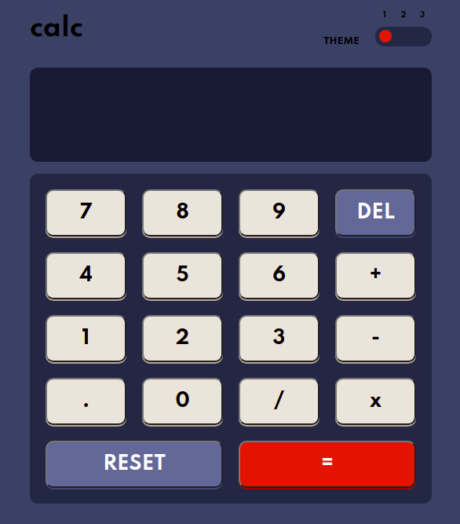
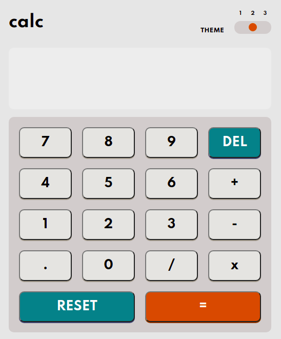
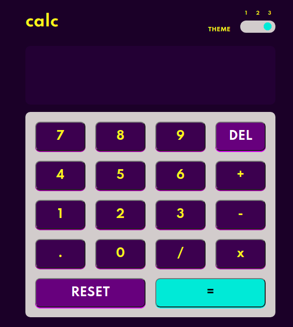

# CalculatorApp

Link: https://github.com/motagabriel/calculatorApp.github.io.git

## Este desafio consistia em fazer uma calculadora com três temas diferentes, sem alternância de página;

### Funcionamento

<h3 align="center">
  
</h3>

### Tema 1

<h3 align="center">
  
</h3>

### Tema 2

<h3 align="center">
  
</h3>

### Tema 3

<h3 align="center">
  
</h3>